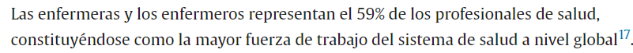
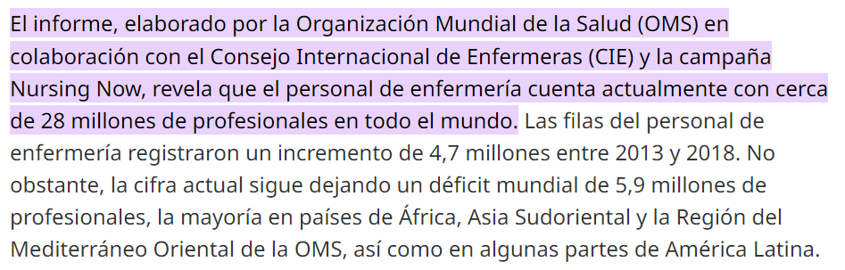
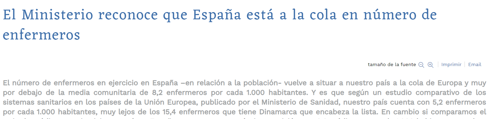
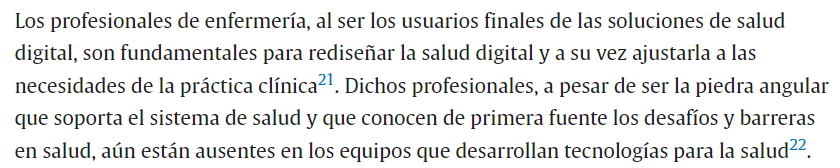

# NOTICIAS ENFERMERÍA DIGITAL
*Author:* Jose Luís Díaz

*Date:* 03/06/2024
## *La importancia de la Enfermería en los procesos de digitalización y el desarrollo de aplicaciones*

Vivimos tiempos en los que la sanidad está teniendo una transformación digital brutal. 

- [Aslan 2024](https://www.comunidad.madrid/noticias/2024/05/01/comunidad-madrid-reconocida-transformacion-digital-su-servicio-publico-salud)

- [Castilla-La Mancha](https://www.castillalamancha.es/actualidad/notasdeprensa/castilla-la-mancha-reconocida-nivel-nacional-por-el-proyecto-de-salud-digital)

- [Microsoft](https://www.google.com/search?q=microsoft+madrid+salud&sca_esv=5c0eb0a9121cd2be&rlz=1C1VDKB_esES1007ES1007&tbm=nws&prmd=nivbz&sxsrf=ADLYWIL5UNUMZZrXvRWbjP0hXSyO0_aJ1Q:1717398068858&source=lnt&tbs=qdr:y&sa=X&ved=2ahUKEwig5dOu7r6GAxWzhv0HHRMhD-gQpwV6BAgBEBA&biw=1163&bih=539&dpr=1.65)

Considero que es fundamental que se tenga en cuenta a la Enfermería, no solo como <u>desarrolladores de aplicaciones</u> integrados en equipos multidisciplinares, sino <u>**LIDERANDO**</u> proyectos debido al peso de la profesión en la sanidad,no solo a nivel Nacional, sino global.

#### OMS y CONSEJO GENERAL DE COLEGIOS DE ENFERMERÍA

Y bueno ... a nivel de España vamos atrasaditos también:

---
---
---

#### Revista Médica Clínica Las Condes

---
---
---

#### REINO UNIDO NHS

[National Health Service](https://transform.england.nhs.uk/digitise-connect-transform/what-good-looks-like/guidance-for-nursing-on-what-good-looks-like/
)

---
---
---

### ❓ EXISTE ALGO ASÍ

### CONCLUSIÓN 

Enfermería es la columna vertebral de cualquier sistema sanitario. Por ello, considero
que es fundamental que esté presente en los procesos de digitalización. No solo como desarrolladores, aquellos que tengan las habilidades necesarias, sino liderando proyectos enfocados a digitalizar procesos de salud.  
